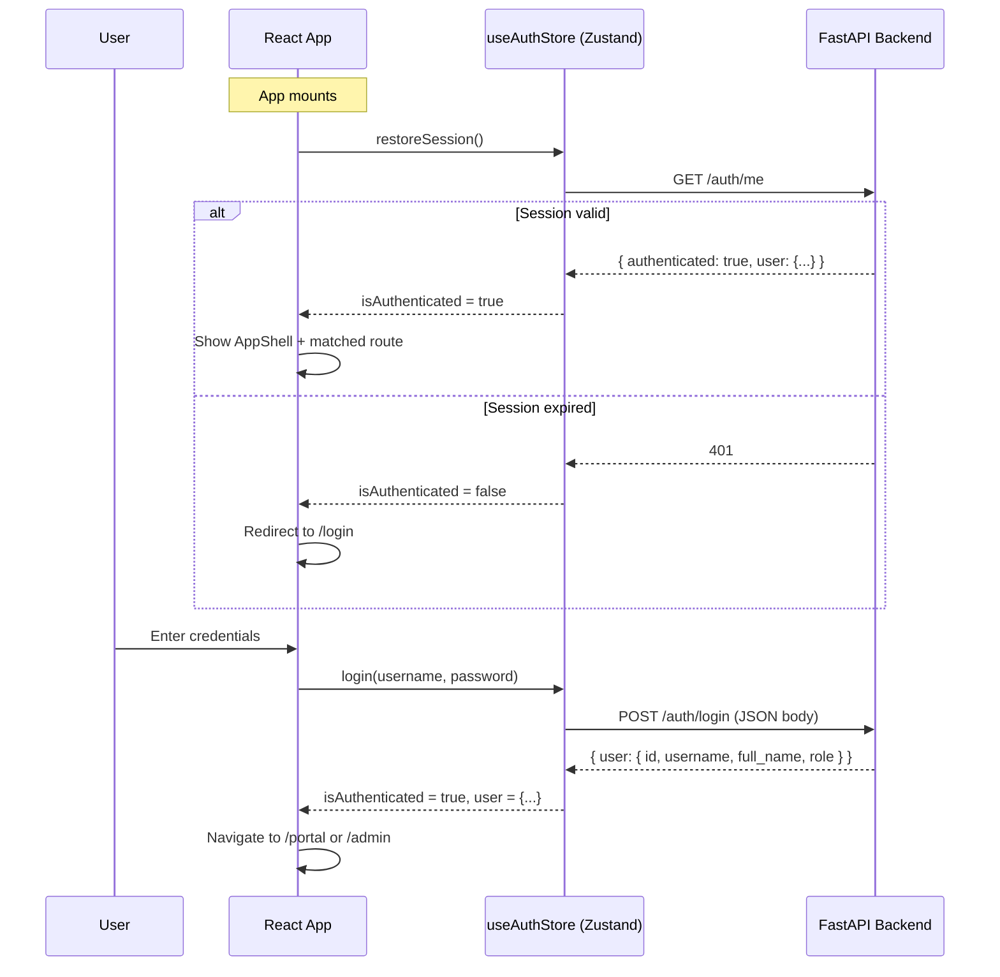

# 🏛️ Frontend Developer Handbook

**Municipality Financial ERP — Region 14 (Isfahan)**
**Version:** 2.0 · **Last Updated:** 1404/11/28 (2026-02-16)
**Audience:** Senior React / TypeScript Developer

---

## Table of Contents

1. [Project Overview — The "Why"](#1-project-overview--the-why)
2. [Technical Stack & Standards](#2-technical-stack--standards)
3. [Architecture & Backend Integration](#3-architecture--backend-integration)
4. [Key Workflows — The "How-To"](#4-key-workflows--the-how-to)
5. [Design Guidelines — The "Look & Feel"](#5-design-guidelines--the-look--feel)
6. [Directory Reference](#6-directory-reference)
7. [Quick-Start Checklist](#7-quick-start-checklist)

---

## 1. Project Overview — The "Why"

This is a **Zero-Trust Financial ERP** for Municipality Region 14 (Isfahan).
Every Rial that enters the system is tracked from budget allocation through to final payment — no money moves without cryptographic-grade audit trails and layered approvals.

### 1.1 The Four Core Modules

| Phase | Module | Purpose | Key Frontend |
|-------|--------|---------|-------------|
| **Phase 1** | **Budgeting** | Select credits via multi-step wizard. Budget rows are guarded by DB-level `CHECK` constraints. | `TransactionWizard` (8 steps) |
| **Phase 2** | **Contracts** | Draft contracts against reserved budget, submit for manager approval, track contractor data. | `ContractWizard`, `ContractDetails`, `ContractsList` |
| **Phase 3** | **Execution** | Create Progress Statements, approve, and pay. Payment permanently converts blocked → spent funds. | `StatementsSection` inside `ContractDetails` |
| **Phase 4** | **Reports** | Executive dashboards: KPI cards, bar/pie charts, budget utilization progress bars. | `ReportsPage` |

### 1.2 The Golden Thread 🧵

Every piece of data is linked through an unbreakable chain:

```
Activity → BudgetRow → CreditRequest → Contract → ProgressStatement → Transaction → AccountCode
```

Understanding this chain is **critical**. When you see a `budget_row_id` on a contract, it traces all the way back to the original budget allocation. When a Progress Statement is marked `PAID`, the money is **permanently deducted** from that budget row. There is **no undo**.

### 1.3 The Credit Request Gateway (Stage 1)

Before **any** transaction can be created, the user must first have an approved **Credit Request** (درخواست تامین اعتبار). This is a mandatory gate:

```
DRAFT → SUBMITTED → APPROVED → (used by Transaction)
```

The `CreditRequestGateSelector` component enforces this in Step 7 of the Transaction Wizard. Without a selected approved Credit Request, the submit button is **disabled**.

---

## 2. Technical Stack & Standards

### 2.1 Core Stack

| Layer | Technology | Notes |
|-------|------------|-------|
| **Framework** | React 18 + TypeScript | Strict mode enabled |
| **Build** | Vite | Fast dev server, HMR |
| **Routing** | React Router v6 | `createBrowserRouter` in `src/app/routes.tsx` |
| **Styling** | Tailwind CSS + Shadcn/UI | 49 pre-configured UI components in `src/components/ui/` |
| **State** | Zustand | Two stores: `useAuthStore`, `useTransactionStore` |
| **Forms** | React Hook Form + Zod | Schema-based validation |
| **Visualization** | Recharts | Bar, Pie, responsive containers |
| **Notifications** | Sonner | Toast notifications (`toast.success()`, `toast.error()`) |
| **Icons** | Lucide React | Consistent icon set throughout |
| **Backend** | FastAPI (Python) | JSON REST API, session cookies |

### 2.2 Coding Standards

> [!IMPORTANT]
> The UI must be **"Executive Grade"**. This system is used by municipality managers and financial officers. Clean padding, readable fonts, clear visual hierarchy, and zero clutter.

- **TypeScript Strict Mode** — No `any` in new code. Use proper generics (see `api.get<T>()`).
- **Persian-first** — All user-facing strings are in Persian. Error messages, labels, tooltips — everything.
- **RTL-native** — The root `<div dir="rtl">` is set in `AppShell`. All layout assumptions are RTL.
- **Functional Components** — No class components. Use hooks exclusively.
- **Zustand Selectors** — Always use atomic selectors to prevent infinite re-renders:
  ```tsx
  // ✅ Correct
  const selectedActivity = useTransactionStore((s) => s.selectedActivity);

  // ❌ Wrong — causes re-renders on every store change
  const { selectedActivity } = useTransactionStore();
  ```

---

## 3. Architecture & Backend Integration

### 3.1 Application Shell

```
                        ┌─────────────────────────┐
                        │     AppShell.tsx         │
                        │   (dir="rtl")           │
                        │                         │
                        │  ┌──────┐  ┌──────────┐ │
                        │  │ Side │  │ TopBar   │ │
                        │  │ Nav  │  ├──────────┤ │
                        │  │      │  │  <Outlet> │ │
                        │  │      │  │  (pages)  │ │
                        │  └──────┘  └──────────┘ │
                        └─────────────────────────┘
```

- `SideNav` renders on `side="right"` (RTL) with collapsible icon mode.
- `TopBar` shows user info and breadcrumbs.
- `<Outlet>` renders the matched page from `routes.tsx`.
- `RequireAuth` HOC wraps all protected routes — redirects to `/login` if unauthenticated.

### 3.2 Route Map

| Path | Component | Access | Description |
|------|-----------|--------|-------------|
| `/login` | `LoginPage` | Public | Auth layout (no sidebar) |
| `/public` | `PublicDashboardPage` | Public | Public-facing dashboard |
| `/portal` | `UserPortalPage` | User | User dashboard, wizard launcher, transactions list, credit requests |
| `/admin` | `AdminDashboardPage` | Admin | Admin transaction review, approval panel |
| `/contracts` | `ContractsList` | Auth | List all contracts with status filters |
| `/contracts/new` | `NewContract` | Auth | Contract creation wizard |
| `/contracts/:id` | `ContractDetails` | Auth | Single contract: details, statements, approval actions |
| `/reports` | `ReportsPage` | Admin | Executive dashboard with charts |
| `/accounting` | `AccountingPage` | Admin | Accounting posting inbox |
| `/forbidden` | `ForbiddenPage` | Any | 403 error page |

### 3.3 The Service Layer Pattern

All backend communication goes through **service files** in `src/services/`. No component should ever call `fetch()` directly.

```
┌─────────────────────────────────────────────────────────┐
│ Components / Pages                                      │
│   └── Call service functions (e.g., fetchContracts())   │
│       └── services/*.ts                                 │
│           └── api.ts  (base HTTP client)                │
│               └── fetch() with credentials: 'include'  │
│                   └── FastAPI Backend                   │
└─────────────────────────────────────────────────────────┘
```

#### `api.ts` — The Base Client

Located at `src/services/api.ts`, this is the single point for all HTTP requests:

```typescript
export const api = {
    get: <T>(endpoint, params?) => request<T>(endpoint, { method: 'GET', params }),
    post: <T>(endpoint, data?) => request<T>(endpoint, { method: 'POST', body: ... }),
    put: <T>(endpoint, data?) => request<T>(endpoint, { method: 'PUT', body: ... }),
    delete: <T>(endpoint) => request<T>(endpoint, { method: 'DELETE' }),
};
```

**Key behaviors:**
- Uses `credentials: 'include'` for session cookies (no JWT tokens in headers).
- Auto-redirects to `/login` on `401 Unauthorized`.
- Throws `ForbiddenError` on `403` (caught by `ForbiddenPage`).
- All errors include Persian error messages from the backend.

#### Service Files at a Glance

| File | Purpose | Key Functions |
|------|---------|---------------|
| `auth.ts` | Login, logout, session restore | `authService.login()`, `.getCurrentUser()` |
| `contracts.ts` | Full contract + statement CRUD | `fetchContracts()`, `createContractDraft()`, `transitionContractStatus()`, `createStatement()`, `approveStatement()`, `payStatement()` |
| `transactions.ts` | Org structure + transaction CRUD | `dataService.getZones()`, `.getBudgetItems()`, `transactionService.create()` |
| `adapters.ts` | **Adapter Pattern** — transforms backend schemas to UI format | `adaptBudgetItem()`, `fetchBudgetsByActivity()`, `createTransaction()`, `approveTransaction()` |
| `budgetValidation.ts` | Real-time budget availability check hook | `useBudgetValidation()` (React Hook), `blockBudgetFunds()` |
| `creditRequestService.ts` | Credit Request gateway API | `createCreditRequest()`, `submitCreditRequest()`, `approveCreditRequest()` |
| `accounting.ts` | Accounting posting module | `fetchAccountingInbox()`, `postTransaction()`, `batchPostTransactions()` |
| `admin.ts` | Admin transaction review | `adminService.getTransactions()`, `.approveTransaction()` |

#### The Adapter Pattern (`adapters.ts`)

> [!NOTE]
> The backend returns `title` for names, the UI components expect `name`. The adapter layer handles this translation so neither side needs to change.

```typescript
// Backend returns:  { id: 1, title: "عمرانی", code: "Z14" }
// UI expects:       { id: 1, name: "عمرانی",  code: "Z14" }

export function adaptOrgUnit(backend: any): FigmaOrgUnit {
    return {
        id: backend.id,
        code: backend.code || '',
        name: backend.title || backend.name || '',
    };
}
```

This adapter pattern exists for: `OrgUnit`, `BudgetItem`, `FinancialEvent`, `CostCenter`, `ContinuousAction`, and `Transaction`.

### 3.4 Authentication Flow



**Key points:**
- Authentication uses **session cookies** (`credentials: 'include'`), not JWT Bearer tokens.
- The `useAuthStore` (Zustand) manages `user`, `isAuthenticated`, and `isLoading` state.
- `RequireAuth` component (in `src/components/RequireAuth.tsx`) wraps all protected routes.
- Two roles: `user` (standard portal) and `admin` (management + approvals).
- On 401, `api.ts` auto-imports `useAuthStore` and calls `logout()` → redirects to `/login`.

### 3.5 State Management

#### `useAuthStore` (Zustand)
- `user: User | null` — Current logged-in user.
- `isAuthenticated: boolean` — Auth state.
- `isLoading: boolean` — Starts as `true` to check session on mount.
- Actions: `login()`, `logout()`, `restoreSession()`, `clearError()`.
- **Selectors:** Use `selectUser`, `selectIsAuthenticated`, `selectIsAdmin`.

#### `useTransactionStore` (Zustand)
- `dashboardData: DashboardInitResponse | null` — Full portal init data (user context, subsystem, activities).
- `selectedActivity: AllowedActivity | null` — The activity card clicked in the dashboard.
- `showWizard: boolean` — Controls Transaction Wizard visibility.
- Actions: `fetchDashboardInit()`, `startWizard(activity)`, `closeWizard()`.
- **Selectors:** `selectUserContext`, `selectSubsystem`, `selectActivities`.

### 3.6 Data Models (Backend — What You Visualize)

The backend (FastAPI + SQLAlchemy) has **30+ models** across these domains:

#### Core Organizational
| Model | Table | Purpose |
|-------|-------|---------|
| `OrgUnit` | `org_units` | Hierarchical org chart: Zone → Department → Section |
| `User` | `users` | Users with roles: `USER`, `ADMIN_L1`, `ADMIN_L2`, `ADMIN_L3`, `ADMIN_L4` |
| `Subsystem` | `subsystems` | 14 subsystems (e.g., payroll, procurement, civil works) |
| `SubsystemActivity` | `subsystem_activities` | Activities within each subsystem |
| `ActivityConstraint` | `activity_constraints` | Budget/cost center restrictions per activity |

#### Financial Core
| Model | Table | Purpose |
|-------|-------|---------|
| `BudgetRow` | `budget_rows` | **Zero-Trust budget**: `approved_amount`, `blocked_amount`, `spent_amount` with DB CHECK constraint: `spent + blocked <= approved` |
| `BudgetTransaction` | `budget_transactions` | Ledger: every BLOCK/RELEASE/SPEND operation |
| `CreditRequest` | `credit_requests` | Stage 1 Gateway: must be APPROVED before downstream transactions |
| `Transaction` | `transactions` | Financial transaction with 4-level approval: DRAFT → PENDING_L1…L4 → APPROVED → BOOKED |

#### Contract Lifecycle
| Model | Table | Purpose |
|-------|-------|---------|
| `Contractor` | `contractors` | Contractor entities (from Setad mock service) |
| `ContractTemplate` | `contract_templates` | JSON Schema-driven contract templates |
| `Contract` | `contracts` | Contracts: DRAFT → PENDING_APPROVAL → APPROVED → IN_PROGRESS → COMPLETED → CLOSED |
| `ProgressStatement` | `progress_statements` | Per-contract payment milestones: DRAFT → SUBMITTED → APPROVED → PAID |
| `ContractGuarantee` | `contract_guarantees` | Bank guarantees and performance bonds |

#### Accounting & Audit
| Model | Table | Purpose |
|-------|-------|---------|
| `AccountCode` | `account_codes` | Unique accounting codes generated by the adapter |
| `JournalSnapshot` | `journal_snapshots` | Immutable journal entries frozen at L4 approval |
| `JournalLine` | `journal_lines` | Debit/credit lines within a snapshot |
| `WorkflowLog` | `workflow_logs` | Complete audit trail for all state transitions |
| `TransactionHistory` | `transaction_histories` | Detailed action log per transaction |

---

## 4. Key Workflows — The "How-To"

### 4.1 The Transaction Wizard Pattern

The `TransactionWizard` (`src/components/TransactionWizard.tsx`) is an **8-step multi-stage form** that guides users through creating a financial transaction.

#### Step Flow

| Step | Component | Title (فارسی) | What Happens |
|------|-----------|---------------|-------------|
| 0 | `WizardStep1_AllowedActivities` | انتخاب فعالیت | User selects from their allowed subsystem activities |
| 1 | `WizardStep1_TransactionType` | نوع تراکنش و سال مالی | Expense vs. Capital, Fiscal Year |
| 2 | `WizardStep2_Organization` | انتخاب واحد سازمانی | Zone → Department → Section cascade |
| 3 | `WizardStep3_Budget` | انتخاب ردیف بودجه | Budget rows filtered by activity constraints; real-time remaining balance |
| 4 | `WizardStep4_FinancialEvent` | رویداد مالی و مرکز هزینه | Financial event, cost center, continuous action |
| 5 | `WizardStep5_Attachments` | مستندات و پیوست‌ها | Document uploads, image-based forms |
| 6 | `WizardStep6_Preview` | پیش‌نمایش کد یکتا | Unique code generation preview |
| 7 | `WizardStep7_Submit` + `CreditRequestGateSelector` | ثبت نهایی | Credit request selection (mandatory gate) + final submit |

#### State Management

```typescript
const [currentStep, setCurrentStep] = useState(0);
const [formData, setFormData] = useState<TransactionFormData>({});
```

- `formData` is a **flat object** accumulating data from all steps.
- Each step receives `formData` and `updateFormData` as props.
- The wizard supports **context-aware initialization**: if `selectedActivity` exists in `useTransactionStore`, steps 0–2 are auto-filled and the user starts at step 3.

#### Budget Validation (Critical Path)

```typescript
const budgetValidation = useBudgetValidation(
    formData.budgetItemId,
    formData.amount,
    formData.availableBudget
);
```

This hook:
1. Fetches real-time budget from `GET /budget/row/{id}`.
2. Compares `requestedAmount` against `remaining_available`.
3. Returns `{ isValid, canProceed, errorMessage, warningMessage }`.
4. **Disables the "Next" button** if budget is exceeded.
5. Shows warning if utilization would exceed 80%.

#### Submission Flow (Zero-Trust)

```
1. Validate Credit Request is selected (MANDATORY)
2. Validate all required fields
3. Validate amount ≤ available budget
4. BLOCK budget funds → POST /budget/block
   ↳ If fails → STOP. Show error. DO NOT create transaction.
5. Create transaction → POST /portal/transactions/create
   ↳ Returns unique_code
6. Show success with unique code
```

> [!CAUTION]
> Budget blocking (step 4) MUST succeed before the transaction is created (step 5). This is the "Zero-Trust" guarantee. If the block API fails, the submission halts immediately. Never reorder these operations.

### 4.2 The Contract Wizard

Located at `src/components/contracts/ContractWizard.tsx` (44KB), this is a multi-step form for creating new contracts:

1. **Select Contractor** — Search from verified contractors (from Setad mock).
2. **Select Template** — Choose a contract template (JSON Schema-driven).
3. **Fill Template Fields** — Dynamic form generated from `schema_definition`.
4. **Budget & Amount** — Link budget row, set total contract amount.
5. **Review & Submit** — Preview all data, create draft, optionally submit for approval.

The wizard calls:
- `fetchContractors()` — List contractors with search/pagination.
- `fetchContractTemplates()` — List available templates.
- `fetchContractTemplate(id)` — Get full schema for dynamic form rendering.
- `createContractDraft()` — Create the contract.
- `submitContract(id)` — Move from DRAFT → PENDING_APPROVAL.

### 4.3 The Approval Flow (Manager Interactions)

#### Transaction Approval (4-Level)

```
DRAFT → PENDING_L1 → PENDING_L2 → PENDING_L3 → PENDING_L4 → APPROVED → BOOKED
                  ↓ (reject at any level)
               REJECTED
```

- Admin sees pending transactions in `AdminDashboardPage`.
- `approveTransaction(txId)` advances to next level.
- `rejectTransaction(txId, reason, returnToUser?)`:
  - `returnToUser: false` → REJECTED (final).
  - `returnToUser: true` → DRAFT (user can fix and resubmit).

#### Contract Approval

```
DRAFT → PENDING_APPROVAL → APPROVED → IN_PROGRESS → COMPLETED → CLOSED
                          ↘ REJECTED
```

In `ContractDetails.tsx`:
- If `status === 'PENDING_APPROVAL'`, manager sees an amber banner with **Approve** and **Reject** buttons.
- `transitionContractStatus(id, 'approve')` → APPROVED.
- `transitionContractStatus(id, 'reject')` → REJECTED (releases blocked funds).
- All actions use confirmation dialogs (`ConfirmActionDialog`).

#### Progress Statement Flow

```
DRAFT → SUBMITTED → APPROVED → PAID
```

In `StatementsSection` (inside `ContractDetails`):
- **DRAFT** → "ارسال" (Submit) button.
- **SUBMITTED** → "تایید" (Approve) button (manager).
- **APPROVED** → "پرداخت" (Pay) button.
- **PAID** → Green checkmark, no more actions.

> [!WARNING]
> The "Pay" action on a Progress Statement is **irreversible**. It converts budget from `blocked_amount` to `spent_amount` at the database level. The confirmation dialog clearly warns: "این عملیات غیرقابل بازگشت است" (This operation is irreversible).

### 4.4 Financial Logic — Drafting vs. Paying

| Operation | Budget Effect | Reversible? | When |
|-----------|--------------|-------------|------|
| **Block** (Reserve) | `blocked_amount += N` | ✅ Yes (Release) | Contract created / Transaction submitted |
| **Release** | `blocked_amount -= N` | — | Contract rejected |
| **Spend** (Pay) | `blocked_amount -= N`, `spent_amount += N` | ❌ **No** | Progress Statement paid |

The database enforces: `spent_amount + blocked_amount <= approved_amount` via a CHECK constraint. **Error handling is critical.** If the budget block fails, the frontend must halt the operation and display the exact error to the user.

---

## 5. Design Guidelines — The "Look & Feel"

### 5.1 RTL Support (Right-to-Left)

> [!IMPORTANT]
> **EVERYTHING** must support Persian (فارسی) natively. This is non-negotiable.

- The root layout sets `<div dir="rtl">` in `AppShell.tsx`.
- Sidebar renders on `side="right"`.
- Navigation chevrons: `ChevronRight` for "back", `ChevronLeft` for "forward" (reversed from LTR).
- Text alignment defaults to `text-right`.
- Number inputs use `dir="ltr"` and `className="font-mono"` for proper digit rendering.

### 5.2 Currency Formatting

All monetary values use this pattern:

```typescript
// Standard (with Rial suffix)
const formatCurrency = (amount: number): string =>
    new Intl.NumberFormat('fa-IR').format(amount) + ' ریال';

// Abbreviated (for dashboards)
function formatAmount(value: number): string {
    if (value >= 1_000_000_000) return `${(value / 1_000_000_000).toFixed(1)} میلیارد`;
    if (value >= 1_000_000) return `${(value / 1_000_000).toFixed(1)} میلیون`;
    return value.toLocaleString('fa-IR');
}
```

**Rules:**
- **Always** comma-separate: `۱۰۰,۰۰۰,۰۰۰ ریال` (never `100000000`).
- Use `fa-IR` locale for `toLocaleString()` / `Intl.NumberFormat`.
- Financial values always show " ریال" suffix.
- Use `font-mono` class for numeric displays.
- Numbers render LTR: `<span dir="ltr">...</span>`.

### 5.3 Date Formatting

All dates must be displayed in **Jalali (Solar Hijri)** calendar.

- Current fiscal year: `1403`.
- Format: `YYYY/MM/DD` Jalali (e.g., `1403/08/15`).
- The backend stores dates in ISO format; frontend should convert for display.

### 5.4 Status Badges

Status indicators follow this consistent color system:

| Status | Persian Label | Color Scheme |
|--------|-------------|-------------|
| DRAFT | پیش‌نویس | `bg-slate-100 text-slate-700` |
| SUBMITTED / PENDING | ارسال شده / در انتظار تایید | `bg-amber-100 text-amber-700` |
| APPROVED | تایید شده | `bg-green-100 text-green-700` |
| REJECTED | رد شده | `bg-red-100 text-red-700` |
| IN_PROGRESS | در حال اجرا | `bg-blue-100 text-blue-700` |
| PAID | پرداخت شده | `bg-green-100 text-green-700` |
| COMPLETED | تکمیل شده | `bg-emerald-100 text-emerald-700` |
| CLOSED | بسته شده | `bg-gray-100 text-gray-600` |

Always use the `<Badge>` component from Shadcn/UI.

### 5.5 Responsive Design

- **Desktop** (office managers): Full sidebar, expanded data tables, side-by-side charts.
- **Tablet/Mobile** (site managers): Collapsible sidebar (`collapsible="icon"`), stacked layouts.
- Use `grid-cols-1 sm:grid-cols-2 lg:grid-cols-3` pattern for card grids.
- Step indicators in the wizard: labels are `hidden md:block`.
- Container max-widths: `max-w-4xl` for wizards, `max-w-5xl` for detail pages.

### 5.6 Component Library (Shadcn/UI)

49 pre-configured components in `src/components/ui/`:

**Most heavily used:**
- `Button`, `Card`, `Badge`, `Input`, `Label`, `Textarea`
- `Table`, `TableHeader`, `TableBody`, `TableRow`, `TableCell`
- `Dialog`, `DialogContent`, `DialogHeader`, `DialogFooter`
- `Select`, `Checkbox`, `Progress`, `Tabs`
- `Sidebar`, `SidebarContent`, `SidebarMenu`, `SidebarMenuButton`
- `Sonner` (toasts)

**Chart components:**
- Import from `recharts`: `BarChart`, `PieChart`, `ResponsiveContainer`
- Custom tooltips for Persian formatting (`BarChartTooltip`, `PieChartTooltip`)

---

## 6. Directory Reference

```
frontend/src/
├── app/
│   └── routes.tsx              # React Router config
├── components/
│   ├── contracts/
│   │   └── ContractWizard.tsx  # Multi-step contract creation (44KB)
│   ├── wizard-steps/           # TransactionWizard step components
│   │   ├── WizardStep0_SubsystemSelect.tsx
│   │   ├── WizardStep1_AllowedActivities.tsx
│   │   ├── WizardStep1_TransactionType.tsx
│   │   ├── WizardStep2_Organization.tsx
│   │   ├── WizardStep3_Budget.tsx          # Budget selection with constraints (19KB)
│   │   ├── WizardStep4_FinancialEvent.tsx
│   │   ├── WizardStep5_Attachments.tsx     # Document uploads + image forms (23KB)
│   │   ├── WizardStep6_Preview.tsx
│   │   └── WizardStep7_Submit.tsx
│   ├── ui/                     # 49 Shadcn/UI primitives
│   ├── TransactionWizard.tsx   # Main wizard orchestrator (8 steps)
│   ├── AdminDashboard.tsx      # Admin transaction review panel
│   ├── UserPortal.tsx          # User portal dashboard
│   ├── PublicDashboard.tsx     # Public-facing dashboard
│   ├── Login.tsx               # Login form component
│   ├── RequireAuth.tsx         # Route guard HOC
│   ├── ForbiddenPage.tsx       # 403 error page
│   ├── CreditRequestGateSelector.tsx    # Stage 1 Gate UI
│   ├── CreditRequestManager.tsx         # Credit request management panel
│   ├── CreditRequestAdminPanel.tsx      # Admin CR review panel
│   ├── AccountantLedger.tsx    # Accounting ledger component
│   ├── MyTransactionsList.tsx  # User's transaction list
│   └── TransactionReviewPanel.tsx # Admin review details
├── layouts/
│   ├── AppShell.tsx            # Main shell (sidebar + topbar + outlet)
│   ├── AuthLayout.tsx          # Public pages layout (no sidebar)
│   ├── SideNav.tsx             # RTL sidebar navigation
│   └── TopBar.tsx              # Header bar with user info
├── pages/                      # Route-level page wrappers
│   ├── ContractDetails.tsx     # Contract detail + statements (878 lines)
│   ├── ContractsList.tsx       # Contract listing with filters
│   ├── NewContract.tsx         # New contract page shell
│   ├── ReportsPage.tsx         # Executive dashboard (KPIs + charts)
│   ├── LoginPage.tsx           # Login page wrapper
│   ├── UserPortalPage.tsx      # Portal page wrapper
│   ├── AdminDashboardPage.tsx  # Admin page wrapper
│   └── AccountingPage.tsx      # Accounting page wrapper
├── services/                   # API layer (ALL backend calls)
│   ├── api.ts                  # Base HTTP client
│   ├── auth.ts                 # Authentication service
│   ├── contracts.ts            # Contract + Statement CRUD
│   ├── transactions.ts         # Org data + transaction CRUD
│   ├── adapters.ts             # Backend→UI data transformers
│   ├── budgetValidation.ts     # useBudgetValidation hook
│   ├── creditRequestService.ts # Credit Request gateway
│   ├── accounting.ts           # Accounting posting
│   └── admin.ts                # Admin transaction review
├── stores/                     # Zustand state stores
│   ├── useAuthStore.ts         # Auth state + session management
│   └── useTransactionStore.ts  # Dashboard + wizard state
├── types/                      # TypeScript type definitions
│   ├── index.ts                # Core types (User, Transaction, BudgetItem, etc.)
│   ├── dashboard.ts            # Dashboard init response types
│   ├── creditRequest.ts        # Credit Request types + status config
│   └── accounting.ts           # Accounting module types
├── styles/                     # Additional style files
├── index.css                   # Tailwind base + design tokens (62KB)
├── main.tsx                    # Application entry point
└── App.tsx                     # Root component (renders RouterProvider)
```

---

## 7. Quick-Start Checklist

### First Day Setup

1. **Clone and install:**
   ```bash
   cd frontend
   npm install
   ```

2. **Start dev server:**
   ```bash
   npm run dev
   ```
   The backend (FastAPI) must be running on the same origin or via proxy.

3. **Login with test credentials** — ask project lead for seeded user accounts.

4. **Explore these pages in order:**
   - `/login` → Login flow
   - `/portal` → User dashboard with activity cards
   - Click an activity → Transaction Wizard opens
   - `/contracts` → Contracts list
   - `/contracts/new` → Contract wizard
   - `/reports` → Executive dashboard
   - `/admin` → Admin approval panel (requires admin role)

### Before Writing Any Code

- [ ] Read `src/services/api.ts` — Understand the HTTP client.
- [ ] Read `src/stores/useAuthStore.ts` — Understand auth flow.
- [ ] Read `src/components/TransactionWizard.tsx` — Understand the wizard pattern.
- [ ] Read `src/pages/ContractDetails.tsx` — Understand approvals and statements.
- [ ] Run the app and complete one full transaction flow end-to-end.

### Key Rules to Remember

> [!CAUTION]
> 1. **Never bypass the Credit Request gate.** Every transaction MUST have an approved CR.
> 2. **Budget block before transaction create.** Always. No exceptions.
> 3. **Payment is irreversible.** Double-check all "pay" operations.
> 4. **Use service files.** No raw `fetch()` calls in components.
> 5. **Use Zustand selectors.** Never destructure the entire store.
> 6. **All strings in Persian.** All currency comma-formatted. All dates Jalali.
> 7. **Test RTL.** Every new component must look correct in RTL layout.

---

*Welcome to the team. Build with precision — every Rial matters.* 🏛️
