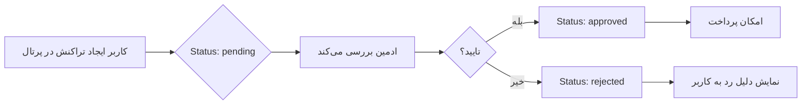

# مستندات پروژه سامانه تولید شناسه یکتا - شهرداری اصفهان

## Municipality Unique Code Generation System

---

## 📋 خلاصه اجرایی

این پروژه یک **سامانه مالی جامع** برای شهرداری اصفهان است که شامل موارد زیر می‌باشد:

- 🔐 **سیستم احراز هویت و مدیریت کاربران** (کاربر عادی و ادمین)
- 🏢 **مدیریت ساختار سازمانی** (مناطق، معاونت‌ها، ادارات، قسمت‌ها)
- 💰 **مدیریت بودجه و ردیف‌های مالی** (هزینه‌ای و سرمایه‌ای)
- 📝 **گردش کار تراکنش‌های مالی** با تایید/رد ادمین
- 🔢 **تولید کدهای یکتای ۱۱ بخشی** برای شناسایی تراکنش‌ها
- 📊 **داشبورد گزارش‌گیری** و مشاهده اسناد مالی

---

## 🛠️ معماری فنی (Technical Stack)

### Backend
| تکنولوژی | نسخه/توضیحات |
|----------|--------------|
| **Framework** | FastAPI (Python) |
| **Database** | PostgreSQL |
| **ORM** | SQLAlchemy |
| **Data Validation** | Pydantic |
| **Server** | Uvicorn |

### Frontend
| تکنولوژی | توضیحات |
|----------|---------|
| **Styling** | TailwindCSS (CDN) |
| **Font** | Vazirmatn (فونت فارسی) |
| **Layout** | RTL with Persian numbers |
| **JavaScript** | Vanilla JS (Fetch API) |

### ساختار پروژه
```
municipality_demo/
├── app/
│   ├── main.py              # 🔥 API اصلی (64+ endpoint)
│   ├── models.py            # 📊 مدل‌های دیتابیس (12 مدل)
│   ├── database.py          # 🔌 اتصال به PostgreSQL
│   ├── schemas.py           # 📐 شماهای Pydantic
│   ├── crud.py              # 💾 عملیات CRUD
│   └── adapters/            # 🔄 آداپتورها
│       ├── org_adapter.py           # ساختار سازمانی
│       ├── budget_adapter.py        # بودجه
│       ├── transaction_adapter.py   # تراکنش‌ها
│       └── account_code_adapter.py  # کدهای یکتا
├── login.html               # 🔐 صفحه ورود
├── portal.html              # 📝 پرتال کاربران (فرم‌های ثبت تراکنش)
├── admin.html               # 👑 داشبورد ادمین
├── index.html               # 📊 داشبورد عمومی اقدامات
├── test_mode2.html          # 🧪 حالت تست (بررسی تراکنش‌ها)
└── *.xlsx                   # 📁 فایل‌های Excel داده‌های ورودی
```

---

## 📊 مدل‌های داده (Database Models)

### 1. جداول پایه (Reference Tables)

#### `OrgUnit` - واحدهای سازمانی
```
┌──────────────┬─────────────────────────────────────────────┐
│ فیلد         │ توضیحات                                      │
├──────────────┼─────────────────────────────────────────────┤
│ id           │ شناسه یکتا                                   │
│ title        │ عنوان (مثال: "منطقه ۵" یا "معاونت مالی")     │
│ code         │ کد عددی (مثال: "05" یا "20")                 │
│ parent_id    │ ارتباط سلسله‌مراتبی با والد                  │
│ org_type     │ نوع: zone/deputy/department/section          │
└──────────────┴─────────────────────────────────────────────┘
```

#### `BudgetItem` - ردیف‌های بودجه
```
┌───────────────────┬─────────────────────────────────────────┐
│ فیلد              │ توضیحات                                  │
├───────────────────┼─────────────────────────────────────────┤
│ budget_code       │ کد بودجه یکتا                            │
│ description       │ شرح ردیف                                 │
│ budget_type       │ نوع: expense (هزینه‌ای) / capital (سرمایه‌ای) │
│ zone/zone_code    │ منطقه مربوطه                             │
│ trustee           │ متولی                                    │
│ approved_1403     │ مصوب سال ۱۴۰۳                            │
│ allocated_1403    │ تخصیص سال ۱۴۰۳                           │
│ spent_1403        │ هزینه شده سال ۱۴۰۳                       │
│ reserved_amount   │ مبلغ رزرو (تراکنش‌های در انتظار)          │
│ remaining_budget  │ مانده قابل استفاده                       │
└───────────────────┴─────────────────────────────────────────┘
```

#### سایر جداول مرجع
- **`FinancialEventRef`** - رویدادهای مالی (تامین اعتبار، پیش‌پرداخت، علی‌الحساب و...)
- **`ContinuousAction`** - اقدامات مستمر
- **`CostCenterRef`** - مراکز هزینه

### 2. جداول کاربران و دسترسی

#### `User` - کاربران
```
┌───────────────────┬─────────────────────────────────────────┐
│ فیلد              │ توضیحات                                  │
├───────────────────┼─────────────────────────────────────────┤
│ username          │ نام کاربری (یکتا)                        │
│ password_hash     │ رمز عبور هش‌شده (SHA-256)                │
│ full_name         │ نام و نام خانوادگی                       │
│ role              │ نقش: "user" یا "admin"                   │
│ default_zone_id   │ منطقه پیش‌فرض کاربر                       │
│ default_dept_id   │ اداره پیش‌فرض                            │
│ default_section_id│ قسمت پیش‌فرض                             │
│ is_active         │ وضعیت فعال/غیرفعال                       │
└───────────────────┴─────────────────────────────────────────┘
```

### 3. جداول تراکنش‌ها

#### `Transaction` - تراکنش‌های مالی
```
┌───────────────────┬─────────────────────────────────────────┐
│ فیلد              │ توضیحات                                  │
├───────────────────┼─────────────────────────────────────────┤
│ unique_code       │ کد یکتای ۱۱ بخشی تولید شده               │
│ status            │ وضعیت: draft→pending→approved/rejected→paid │
│ created_by_id     │ کاربر ایجادکننده                         │
│ reviewed_by_id    │ ادمین بررسی‌کننده                        │
│ zone_id           │ منطقه/معاونت                             │
│ department_id     │ اداره                                    │
│ section_id        │ قسمت                                     │
│ budget_item_id    │ ردیف بودجه                               │
│ amount            │ مبلغ (ریال)                              │
│ beneficiary_name  │ نام ذینفع/پیمانکار                       │
│ contract_number   │ شماره قرارداد                            │
│ form_data         │ JSON - داده‌های فرم پیچیده               │
│ fiscal_year       │ سال مالی                                 │
│ rejection_reason  │ دلیل رد (در صورت رد شدن)                 │
└───────────────────┴─────────────────────────────────────────┘
```

#### `AccountCode` - کدهای یکتای تولید شده
```
┌───────────────────┬─────────────────────────────────────────┐
│ فیلد              │ توضیحات                                  │
├───────────────────┼─────────────────────────────────────────┤
│ unique_code       │ کد کامل (مثال: 20-EXP-11020401-611-0001) │
│ zone_code         │ کد منطقه                                 │
│ category          │ دسته معامله (EXP, SAL, CON, ...)         │
│ budget_code       │ کد بودجه                                 │
│ permanent_code    │ کد حساب دائمی                            │
│ sequence          │ شماره ترتیب                              │
│ request_id        │ شماره درخواست                            │
│ total_amount      │ مبلغ کل                                  │
│ is_balanced       │ آیا تراز است                             │
└───────────────────┴─────────────────────────────────────────┘
```

---

## 🔌 API Endpoints

### احراز هویت (Authentication)
| متد | مسیر | توضیحات |
|-----|------|---------|
| POST | `/auth/login` | ورود کاربر |
| POST | `/auth/logout` | خروج کاربر |
| GET | `/auth/me` | دریافت اطلاعات کاربر جاری |
| POST | `/auth/register` | ثبت‌نام کاربر جدید |
| GET | `/auth/users` | لیست کاربران (فقط ادمین) |

### ساختار سازمانی
| متد | مسیر | توضیحات |
|-----|------|---------|
| GET | `/org/root` | دریافت حوزه‌های سطح اول (مناطق/معاونت‌ها) |
| GET | `/org/{parent_id}/children` | دریافت زیرمجموعه‌های یک واحد |

### بودجه
| متد | مسیر | توضیحات |
|-----|------|---------|
| GET | `/budgets/by-zone/{zone_code}` | بودجه‌های یک منطقه |
| GET | `/budgets` | همه ردیف‌های بودجه |
| GET | `/budget-items` | ردیف‌های بودجه با فیلتر |
| GET | `/budget-items/{budget_code}` | جزئیات یک ردیف |

### تراکنش‌ها (کاربر)
| متد | مسیر | توضیحات |
|-----|------|---------|
| POST | `/transactions` | ایجاد تراکنش جدید |
| GET | `/transactions/my` | تراکنش‌های کاربر جاری |

### مدیریت ادمین
| متد | مسیر | توضیحات |
|-----|------|---------|
| GET | `/admin/transactions` | لیست همه تراکنش‌ها |
| GET | `/admin/transactions/{id}` | جزئیات تراکنش |
| POST | `/admin/transactions/{id}/approve` | تایید تراکنش |
| POST | `/admin/transactions/{id}/reject` | رد تراکنش |

### سایر
| متد | مسیر | توضیحات |
|-----|------|---------|
| POST | `/portal/submit` | تولید کد یکتای ۱۱ بخشی |
| GET | `/continuous-actions` | لیست اقدامات مستمر |
| GET | `/financial-events` | لیست رویدادهای مالی |
| GET | `/cost-centers` | لیست مراکز هزینه |
| GET | `/account-codes` | کدهای یکتا |

---

## 🔢 ساختار کد یکتای ۱۱ بخشی

```
XX - XX - XXX - XXXXXXXX - XXX - XX - XXX - XXXXXX - XXX - XXXX - XXX
│    │    │     │          │     │    │     │        │     │      │
│    │    │     │          │     │    │     │        │     │      └─ ترتیب
│    │    │     │          │     │    │     │        │     └──────── سال مالی
│    │    │     │          │     │    │     │        └────────────── رویداد مالی
│    │    │     │          │     │    │     └─────────────────────── نام ذینفع (هش)
│    │    │     │          │     │    └───────────────────────────── فعالیت خاص
│    │    │     │          │     └────────────────────────────────── فعالیت مستمر
│    │    │     │          └──────────────────────────────────────── مرکز هزینه
│    │    │     └─────────────────────────────────────────────────── کد بودجه
│    │    └───────────────────────────────────────────────────────── کد قسمت
│    └────────────────────────────────────────────────────────────── کد اداره
└─────────────────────────────────────────────────────────────────── کد منطقه/معاونت
```

**مثال:**
```
20-02-015-11020401-001-01-000-A1B2C3-001-1403-001
```

---

## 🌐 صفحات وب (Frontend)

### 1. صفحه ورود (`/login`)
- ورود با نام کاربری و رمز عبور
- امکان ثبت‌نام اولین ادمین
- هدایت خودکار بر اساس نقش (admin→dashboard, user→portal)

### 2. پرتال کاربر (`/portal`)
- **حالت ویزارد:** فرم گام‌به‌گام انتخاب:
  - حوزه (منطقه/معاونت)
  - اداره
  - قسمت
  - ردیف بودجه
  - مرکز هزینه
  - فعالیت مستمر/غیرمستمر
  - رویداد مالی
  - مشخصات قرارداد/ذینفع
- **پیش‌نمایش زنده کد:** نمایش Real-time کد یکتا
- **فرم‌های پیچیده:** فرم‌های محاسباتی برای:
  - پیمانکاران (صورت وضعیت با کسورات)
  - هزینه‌های جاری
  - استرداد سپرده
  - جابجایی حساب

### 3. داشبورد ادمین (`/admin`)
- **آمار کلی:** تراکنش‌های Pending/Approved/Rejected/Total
- **فیلتر و جستجو:** وضعیت، کد یکتا، ذینفع
- **جدول تراکنش‌ها:** با امکان:
  - مشاهده جزئیات
  - تایید تراکنش
  - رد تراکنش با ذکر دلیل
- **صفحه‌بندی (Pagination)**

### 4. داشبورد عمومی (`/`)
- نمایش تجمیعی اقدامات و بودجه
- لیست کدهای یکتای تولید شده
- امکان مشاهده ریز تراکنش‌ها

---

## 🔄 گردش کار (Workflow)



### وضعیت‌های تراکنش:
| وضعیت | توضیح | رنگ |
|-------|-------|-----|
| `draft` | پیش‌نویس | خاکستری |
| `pending` | در انتظار تایید | زرد |
| `approved` | تایید شده | سبز |
| `rejected` | رد شده | قرمز |
| `paid` | پرداخت شده | آبی |

---

## 🚀 نحوه اجرا

### پیش‌نیازها
1. Python 3.10+
2. PostgreSQL 13+
3. pip packages از `requirements.txt`

### اجرای پروژه
```bash
# نصب وابستگی‌ها
pip install -r requirements.txt

# اجرای سرور
uvicorn app.main:app --reload --host 0.0.0.0 --port 8000
```

### آدرس‌ها
- **صفحه اصلی:** http://localhost:8000/
- **ورود:** http://localhost:8000/login
- **پرتال:** http://localhost:8000/portal
- **ادمین:** http://localhost:8000/admin
- **API Docs:** http://localhost:8000/docs

---

## 📁 فایل‌های داده (Excel)

| فایل | محتوا |
|------|-------|
| `org_structure.xlsx` | ساختار سازمانی |
| `budget.xlsx` | ردیف‌های بودجه |
| `اعتبارات هزینه ای.xlsx` | بودجه هزینه‌ای |
| `تملک دارایی سرمایه ای.xlsx` | بودجه سرمایه‌ای |
| `cost_centers.xlsx` | مراکز هزینه |
| `combined_output_version_2.xlsx` | داده‌های تجمیعی |
| `_شهرداری مرکزی گزارش دفتر مرکزی1403.xlsx` | گزارش‌های مالی |

---

## 🔒 امنیت

- **Authentication:** Session-based با Cookie
- **Password Hashing:** SHA-256
- **Authorization:** Role-based (user/admin)
- **Session Storage:** In-memory (برای Production باید Redis استفاده شود)

---

## 📍 نکات مهم

1. **RTL Support:** کل UI به صورت راست‌به‌چپ طراحی شده
2. **Persian Date:** تاریخ‌ها به صورت شمسی (مثال: 1403/09/17)
3. **Persian Numbers:** اعداد در UI به صورت فارسی نمایش داده می‌شوند
4. **Responsive:** طراحی واکنش‌گرا برای موبایل و دسکتاپ

---

## 📞 پشتیبانی

این پروژه برای **شهرداری اصفهان - معاونت مالی و اقتصادی** توسعه یافته است.

---

*آخرین به‌روزرسانی: ۱۴۰۳/۰۹/۲۳*
